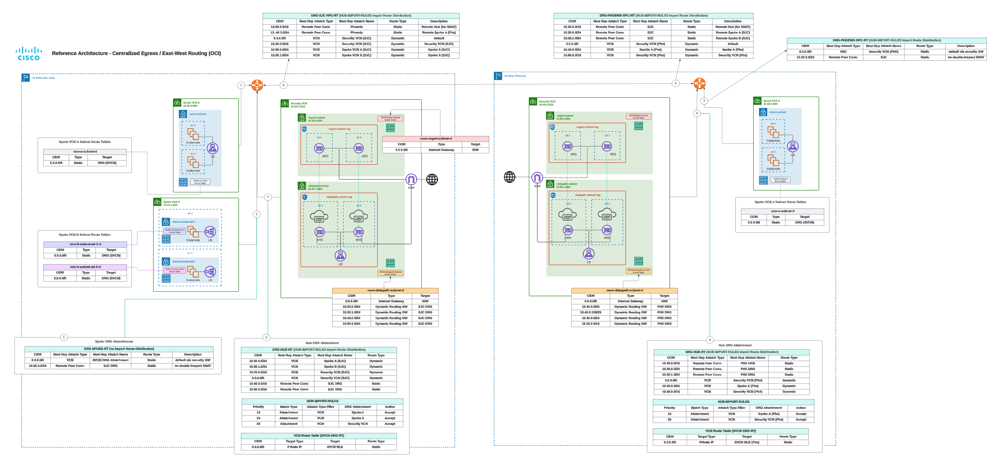

# OCI & Multicloud Defense POC Lab Setup

This repo is intended for a quick and versatile setup of the Oracle OCI proof-of-concept lab environment, so that Cisco Multicloud Defense can be tested againsts multiple regions, providing localized protection in each. Please reference the digram seen below:

There a a few pre-requisites and steps that must be followed in order to get this setup working. Please follow the steps below.

 > **Note:** The Oracle OCI multicloud defense gateways are NOT launched using terraform yet. You will need to launch them manually, from the UI.
# Installation Steps

 1. Clone the repository
 2. Modify the following files and variables within the repository:
	 - [ ] **key_files/multicloud_key.json** --> input the contents of your Cisco Multicloud Defense API key
	 - [ ] **key_files/oci_public_key.pub** --> input the public SSH key you will utilize to SSH to the testing VM's within OCI
	 - [ ] **key_files/priv_key.pem**  --> input the contents of your OCI API key, private key into here (downloaded when you create your OCI api key
	 - [ ] **terraform.tfvars**
	    - [ ] ***compartment_ocid*** --> (put your compartment ocid in here)
            - [ ] *** SJC and PHX Availability zone names*** --> the genius's at Oracle decided to randomize AZ names per account, so make sure you glean these from the console and update here
	    - [ ] ***tenancy_id*** --> (From API key - the tenancy ID)
	    - [ ] ***user_id*** --> (From API key - the user ID)
	    - [ ] ***fingerprint*** --> (From API key - the fingerprint)
 4. Exe ute the bash script by running '**./ciscomcd_oci.sh**'
 > **Note:** You may need to explicitly allow execution permissions for this script. Use 'chmod +x ciscomcd_oci.sh' to achieve this. This script will take several minutes to complete.
 
 4. Onboard your Oracle OCI account into Cisco Multicloud Defense by following this guide: https://docs.defenseorchestrator.com/multicloud/index.html#!g_oci.html
 5. Deploy the Multicloud Defense gateways into the Phoenix and San Jose regions. Use the policies prefixed with 'tf-oci-egress-group' during this process.
 6. Once this is finished we need to put in 1 route, in each region (this step was not possible before the gateways, and subsequently the network load-balancer was created). Put in the following 2 routes:
	- [ ] Within each region in OCI, navigate to network-load-balanceClick on the 'ciscomcd' load-balancer, and copy it's private IP address
	- [ ] Next go to the Virtual Cloud Networks screen, and select the that is the hub (labeled with 'svcn' in the name).
	- [ ] Click on Route Tables, and find the route table (in CAPS), thas DRG-RT at the end of the name. This route-table should currenhave no routes
	- [ ] Add a route rule, with a target type of private IP. Destination CIDR block will be 0.0.0.0/0, and the target selection wbe the load balancer IP you previously copied
 7. Create your rule(s) within the tf-oci-egress-standalone ruleset and get testing!
 > **Note:** Do not forget to do this in Phoenix, and San Jose regions
 > **Note:** When I test, I put routes in the VNC route tables to route traffic to my public IP, out the local Internet GW.
